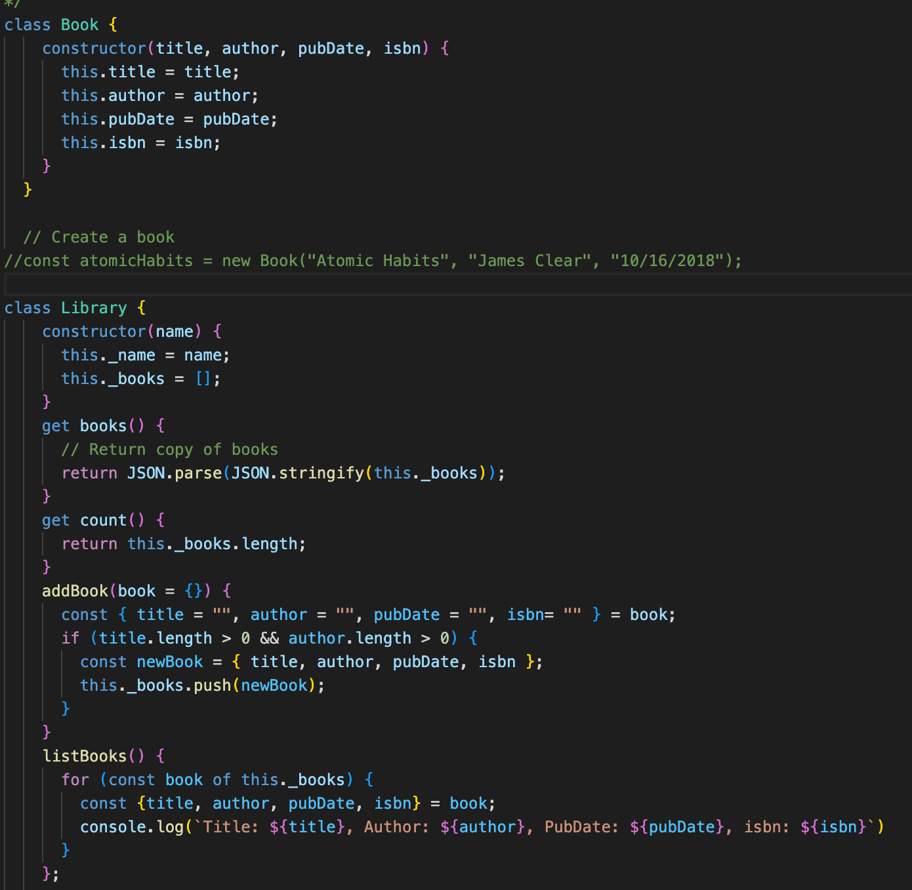

# cit281-lab-6
[cit281 lab-6](https://github.com/UO-CIT-qiqima/cit281-lab-6)

Lab 6:
1. Create and test Book class.
2. Create and test Library class.
3. Add at least two more books to the library.
4. Add ISBN and a delete book method.

